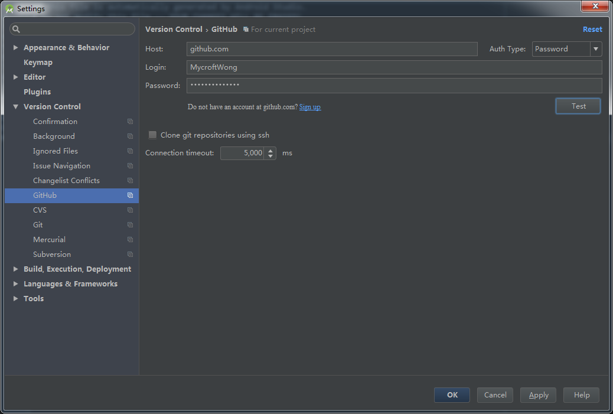
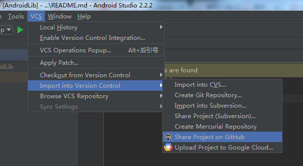
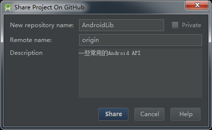
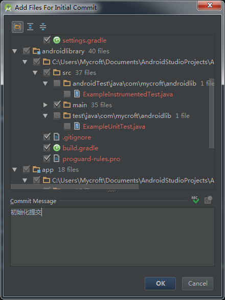
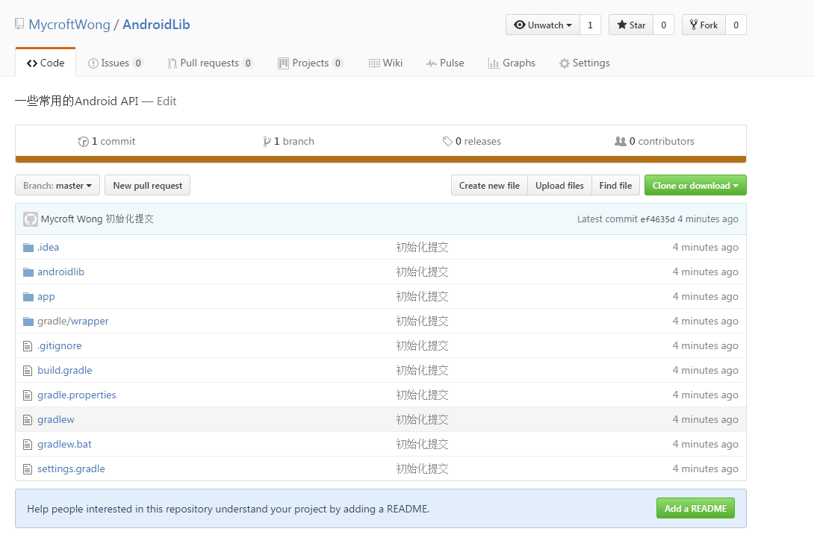
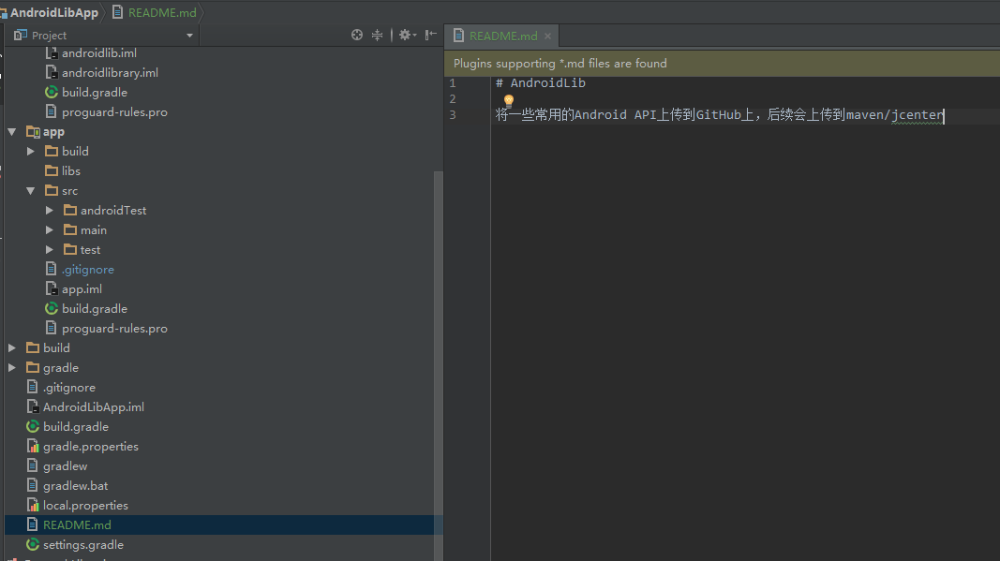
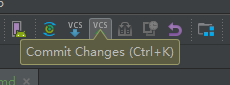
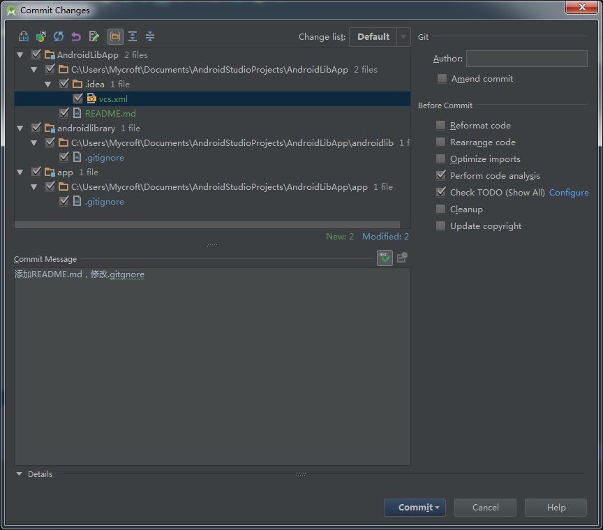

# Android项目上传至github

### 1. 在Android Studio中配置github信息



### 2. 选择上传到GitHub



### 3. 分享设置



### 4. 初始化提交

初始化提交，去掉一些没有在gitgnore中声明的文件



之后Android Studio会自动将项目上传到GitHub上


在GitHub上可以看到该项目



### 5. 在Android项目中添加```README.md```文件



### 6. 提交本地更改



填写提交信息




<br/>
<br/>
<br/>
<br/>
<br/>
<br/>
<br/>
<br/>
<br/>
<br/>
<br/>
<br/>
<br/>
<br/>
<br/>
<br/>
<br/>
<br/>
<br/>
<br/>
<br/>
<br/>
<br/>
<br/>
<br/>
<br/>
<br/>
<br/>
<br/>
<br/>
<br/>
<br/>
<br/>
<br/>
<br/>
